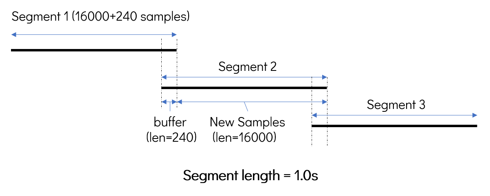

# Simul-Whisper

Code and models for INTERSPEECH 2024 paper *[Simul-Whisper: Attention-Guided Streaming Whisper with Truncation Detection](https://arxiv.org/pdf/2406.10052)*

## Setups

### Download openai-whisper model checkpoints

We used the model checkpoints provided by [openai-whisper](https://github.com/openai/whisper) in their [open-sourced code](https://github.com/openai/whisper/blob/main/whisper/__init__.py) and the download links are as follows: 

|Model|Link|
|-----|----|
|base|[Download](https://openaipublic.azureedge.net/main/whisper/models/ed3a0b6b1c0edf879ad9b11b1af5a0e6ab5db9205f891f668f8b0e6c6326e34e/base.pt)|
|small|[Download](https://openaipublic.azureedge.net/main/whisper/models/9ecf779972d90ba49c06d968637d720dd632c55bbf19d441fb42bf17a411e794/small.pt)|
|medium|[Download](https://openaipublic.azureedge.net/main/whisper/models/345ae4da62f9b3d59415adc60127b97c714f32e89e936602e85993674d08dcb1/medium.pt)|
|large-v2|[Download](https://openaipublic.azureedge.net/main/whisper/models/81f7c96c852ee8fc832187b0132e569d6c3065a3252ed18e56effd0b6a73e524/large-v2.pt)|

### Install dependencies

We used Python 3.9.16 and PyTorch 2.0.1, but the codes may be compatible with other close Python and PyTorch versions. Other dependencies are listed in `requirements.txt`.

## Python Usage

A sample code is provided in `transcribe.py`. This code includes three main steps: 

### 1. Configurations

```python
    cfg = AlignAttConfig(
        model_path=model_path, # path to the downloaded whisper model
        segment_length=segment_length, # chunk length, in seconds
        frame_threshold=frame_threshold, # threshold for the attention-guided decoding, in frames
        language=language,
        buffer_len=buffer_len, # the lengths for the context buffer, in seconds
        min_seg_len=min_seg_len, # transcibe only when the context buffer is larger than this threshold. Useful when the segment_length is small
        if_ckpt_path=if_ckpt_path,
    )
```

### 2. Model Initialization

```python
    model = PaddedAlignAttWhisper(cfg)
    segmented_audio = SegmentWrapper(audio_path=audio_path, segment_length=segment_length)
```

In order to provide similar CNN features at audio boundaries for streaming and non-streaming inference, we retained a 240-sample buffer. The process of reading audio is shown in the following figure:



### 3. Transcribe the segments

```python
    hyp_list = []
    for seg_id, (seg, is_last) in enumerate(segmented_audio):
        new_toks = model.infer(seg, is_last)
        hyp_list.append(new_toks)
        hyp = torch.cat(hyp_list, dim=0)
        hyp = hyp[hyp < DEC_PAD]
        hyp = model.tokenizer.decode(hyp)
        print(hyp)

    model.refresh_segment(complete=True) # refresh the buffer when an utterance is decoded
```

When transcribing two different utterances, it is necessary to call `model.refresh_segment' to refresh the buffer after the end of the first utterance.

## Reference Repositories

This code is based on [openai-whisper](https://github.com/openai/whisper) and [whisper_streaming](https://github.com/ufal/whisper_streaming).
